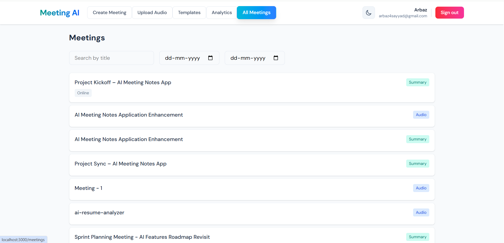
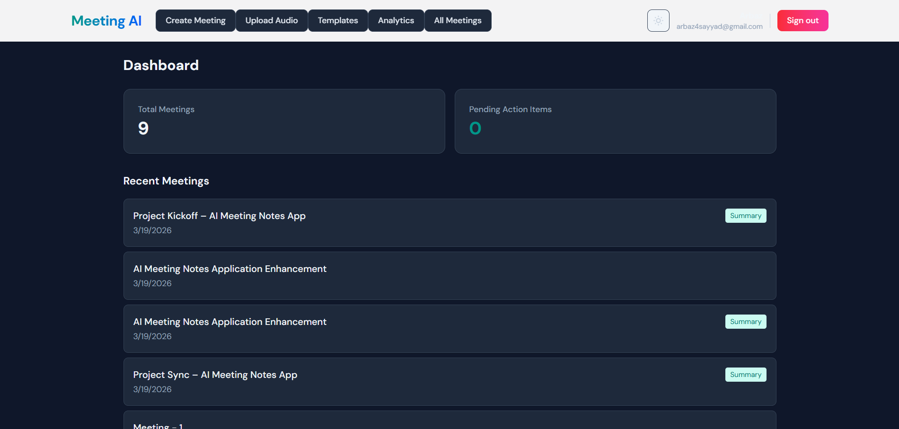
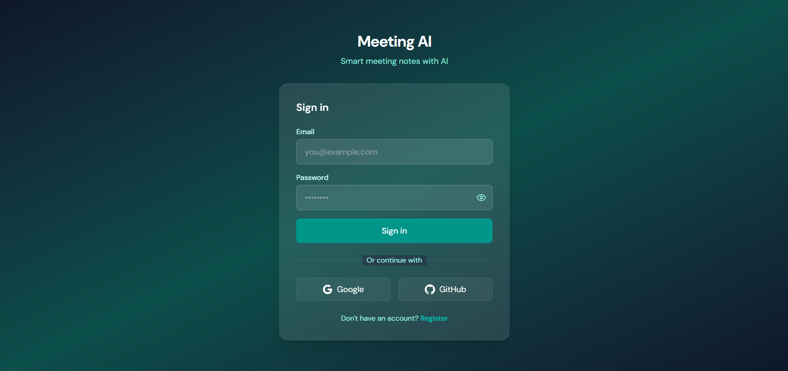
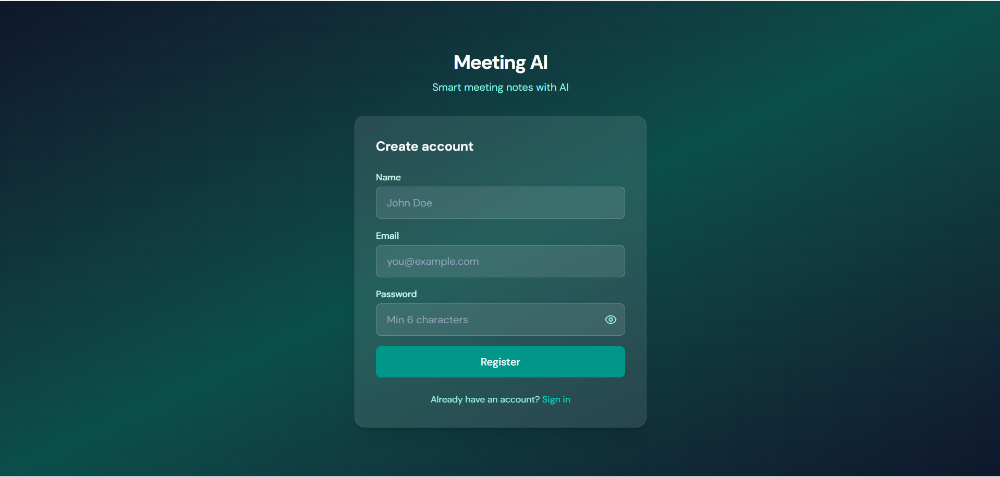
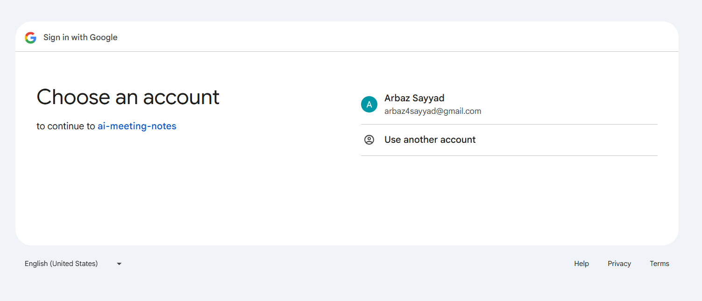
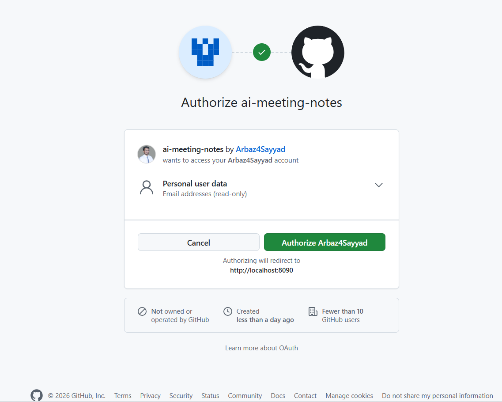
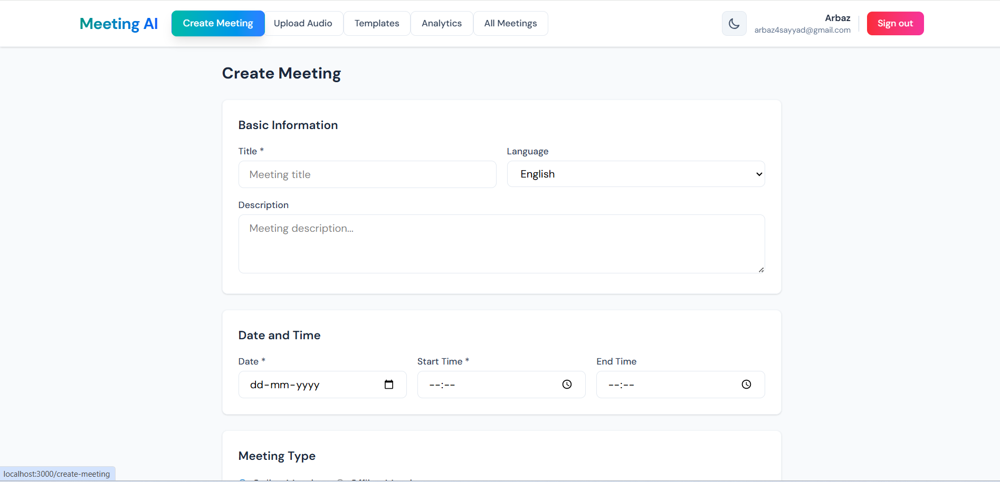
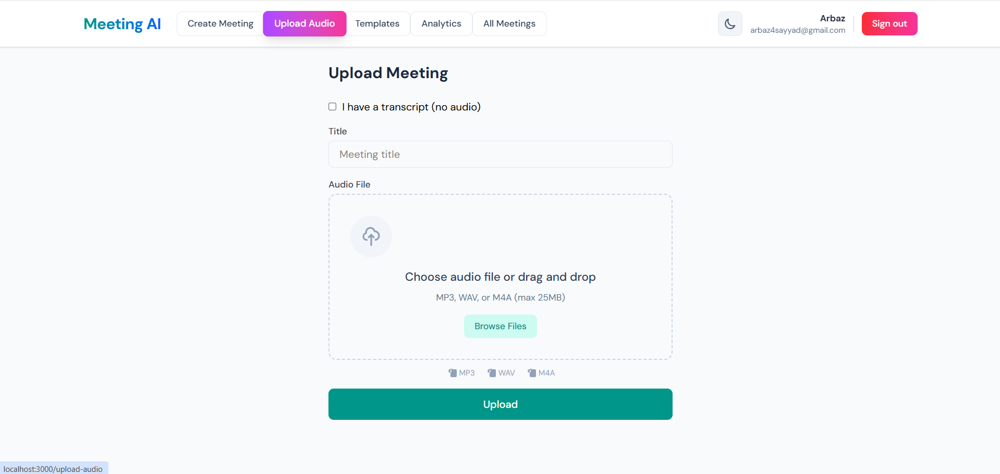

# 🤖 AI Meeting Notes - Intelligent Meeting Management System

[](https://opensource.org/licenses/MIT)
[](https://www.oracle.com/java/)
[](https://spring.io/projects/spring-boot)
[](https://reactjs.org/)
[](https://www.docker.com/)

A production-grade AI-powered meeting management system that automatically transcribes audio recordings and generates **actionable intelligence** with **structured insights** for enhanced **decision-making**.

## ✨ Features

### 🎯 Core Meeting Management
- **Comprehensive Meeting Creation** - Complete metadata capture for **actionable intelligence**
- **Meeting Types** - Support for both online and offline meetings
- **Attendee Management** - Multi-email input with validation
- **Smart Scheduling** - Date/time picker with conflict detection
- **Enhanced Metadata** - Language selection, meeting links, agenda notes

### 🎤 Audio Processing
- **Multiple Format Support** - MP3, WAV, M4A (up to 25MB)
- **Drag-and-Drop Upload** - Modern file upload interface
- **Real-time Validation** - File type and size checking
- **Progress Tracking** - Upload status indicators
- **Multiple Transcription Services** - OpenAI Whisper + Google Speech-to-Text

### 🤖 AI-Powered Intelligence
- **Automatic Transcription** - Multiple service support with fallback
- **Intelligent Summarization** - Generates **actionable intelligence** with **structured insights**
- **Enhanced Decision-Making** - Clear action items and risk identification
- **Risk Identification** - Automatic blocker detection
- **Decision Tracking** - Key decisions automatically extracted
- **Participant Recognition** - AI identifies key attendees

### 📊 Structured Output
1. **Overview** - Meeting context and purpose
2. **Key Discussion Points** - Detailed topics with technical details
3. **Decisions Made** - Specific confirmed decisions
4. **Action Items** - Task assignments with ownership
5. **Risks / Issues** - Blockers and concerns
6. **Next Steps** - Follow-up actions and deliverables
7. **Participants** - Key attendees and roles

### 🎨 User Experience
- **Modern UI** - Clean, responsive design with TailwindCSS
- **Real-time Validation** - Immediate form feedback
- **Loading States** - Progress indicators for all operations
- **Error Handling** - User-friendly error messages
- **Mobile Responsive** - Works on all devices
- **Professional Interface** - Enterprise-ready design

## 🏗️ Architecture

### Backend (Java Spring Boot)
```
├── 📁 src/main/java/com/app/meetingai/
│   ├── 🎮 controller/          # REST API endpoints
│   ├── 🛠️ service/             # Business logic & AI integration
│   ├── 📊 model/               # JPA entities with enhanced fields
│   ├── 📦 dto/                 # Data transfer objects
│   ├── 🔐 security/            # JWT authentication
│   ├── 🤖 ai/                  # AI services (Gemini, Whisper)
│   ├── 🗄️ repository/          # Database access
│   └── ⚙️ config/              # Configuration & error handling
```

### Frontend (React + Vite)
```
├── 📁 src/
│   ├── 📄 pages/               # React components
│   │   ├── CreateMeeting.jsx   # NEW: Comprehensive meeting form
│   │   ├── MeetingsList.jsx    # Enhanced with metadata display
│   │   └── MeetingUpload.jsx   # Improved audio upload
│   ├── 🔌 api/                 # Updated API client
│   ├── 🎨 context/              # React context
│   └── 🎯 assets/               # Static assets
```

### 🐳 Infrastructure
- **Database**: PostgreSQL with optimized indexes and new schema
- **Authentication**: JWT-based security with enhanced validation
- **File Storage**: Local/S3 compatible with validation
- **Containerization**: Docker Compose ready (dev + prod)
- **API Documentation**: OpenAPI/Swagger with new endpoints

## 🚀 Quick Start

### Prerequisites
- **Java 17+** and Maven 3.6+
- **Node.js 16+** and npm/yarn
- **PostgreSQL** database
- **Docker** and Docker Compose

### Environment Setup

#### Backend Configuration (.env)
```bash
# Required for AI summaries
GEMINI_API_KEY=your_gemini_api_key

# Optional transcription services (choose one or both)
OPENAI_API_KEY=your_openai_api_key          # For Whisper
GCP_PROJECT_ID=your_gcp_project_id          # For Google Speech-to-Text
GCP_CREDENTIALS_PATH=path/to/credentials.json

# Database
DB_URL=jdbc:postgresql://localhost:5432/meeting_ai
DB_USER=postgres
DB_PASSWORD=password

# Security
JWT_SECRET=your_32_character_secret_key
```

#### Frontend Configuration (.env)
```bash
VITE_API_URL=http://localhost:8080
```

### Running the Application

#### Option 1: Docker (Recommended)
```bash
# Clone and run
git clone https://github.com/Arbaz4Sayyad/AI-Meeting-Notes.git
cd AI-Meeting-Notes
docker-compose up -d

# Access application
# Frontend: http://localhost:3000
# Backend: http://localhost:8080
# API Docs: http://localhost:8080/swagger-ui.html
```

#### Option 2: Local Development
```bash
# Backend
cd backend
mvn spring-boot:run

# Frontend (new terminal)
cd frontend
npm install
npm run dev
```

## 📱 Usage Guide

### 1. Create Account
- Register with email and password
- Login to access dashboard

### 2. Create Meeting (NEW)
- **Comprehensive Form**: Click "Create Meeting" for full experience
  - Title, description, date, time
  - Online/Offline meeting type with conditional fields
  - Add multiple attendees with email validation
  - Upload audio file with drag-and-drop
  - Add agenda/notes with rich text support
  - Language selection for transcription

### 3. AI Processing
- **Audio Upload**: System automatically transcribes using available services
- **Manual Transcript**: Paste text directly with validation
- **Generate Summary**: AI creates structured 7-section output
- **Review Results**: Check action items, decisions, and risks

### 4. Manage Meetings
- **Enhanced List View**: Shows meeting metadata, type, status
- **Advanced Search**: Filter by date, search by title
- **Quick Actions**: Generate summaries, view details
- **Status Indicators**: See which meetings have summaries/audio

## 🔧 Configuration

### AI Services Priority
1. **OpenAI Whisper** (if OPENAI_API_KEY configured)
2. **Google Speech-to-Text** (if GCP credentials configured)
3. **Manual Entry** (fallback option)

### Customization Options
- **Prompt Engineering**: Modify AI prompts in `GeminiService.java`
- **Validation Rules**: Update DTO validation annotations
- **UI Themes**: Modify TailwindCSS configuration
- **Database**: Adjust schema in `database-schema.sql`
- **New Fields**: Add meeting metadata easily

## 📊 API Documentation

### Authentication
- `POST /api/auth/register` - User registration
- `POST /api/auth/login` - User login

### Meetings (Enhanced)
- `GET /api/meetings` - List meetings with pagination
- `POST /api/meetings` - **NEW**: Create comprehensive meeting
- `POST /api/meetings/basic` - Create basic meeting (legacy)
- `PUT /api/meetings/{id}` - **NEW**: Update meeting details
- `GET /api/meetings/{id}` - Get meeting details
- `POST /api/meetings/upload` - Upload audio file

### AI Features
- `POST /api/meetings/{id}/generate-summary` - Generate AI summary
- `GET /api/meetings/{id}/summary` - Get existing summary
- `PUT /api/meetings/{id}/transcript` - Update transcript

## 🛠️ Development

### Adding New Features
1. **Backend**: Create new controller/service/repository
2. **Frontend**: Add new React components
3. **Database**: Update JPA entities with new fields
4. **API**: Update OpenAPI documentation
5. **Testing**: Add unit and integration tests

### Running Tests
```bash
# Backend tests
cd backend
mvn test

# Frontend tests
cd frontend
npm test
```

### Code Quality
- **Backend**: Maven with Checkstyle and PMD
- **Frontend**: ESLint and Prettier
- **Security**: OWASP dependency check
- **Performance**: JMeter load testing

## 🌐 Deployment

### Production Setup
```bash
# Build and deploy
docker-compose -f docker-compose.prod.yml up -d

# Environment variables
# Configure production API keys
# Set up managed PostgreSQL
# Configure SSL certificates
```

### Scaling Considerations
- **Load Balancer**: Nginx or AWS ALB
- **Database**: Read replicas for scaling
- **File Storage**: S3 or similar for audio files
- **Caching**: Redis for session management
- **Monitoring**: Prometheus + Grafana

## 🔒 Security

### Authentication & Authorization
- **JWT Tokens**: Secure API access
- **Password Hashing**: BCrypt encryption
- **CORS Configuration**: Proper cross-origin handling
- **Input Validation**: Comprehensive request validation
- **File Upload Security**: Type and size restrictions

### Best Practices
- **Environment Variables**: Never commit secrets
- **HTTPS Required**: Production SSL/TLS
- **API Rate Limiting**: Prevent abuse
- **Regular Updates**: Keep dependencies current

## 📈 Monitoring

### Application Logs
```bash
# View logs
docker-compose logs -f backend
docker-compose logs -f frontend

# Log levels
# INFO: Production
# DEBUG: Development
```

### Health Checks
- **Backend Health**: `GET /api/health`
- **Database Health**: Connection pool monitoring
- **AI Services**: API availability checks
- **File Storage**: Disk space monitoring

## 🤝 Contributing

We welcome contributions! Please follow these steps:

1. **Fork** the repository
2. **Create** a feature branch (`git checkout -b feature/amazing-feature`)
3. **Commit** your changes (`git commit -m 'Add amazing feature'`)
4. **Push** to the branch (`git push origin feature/amazing-feature`)
5. **Open** a Pull Request

### Development Guidelines
- **Code Style**: Follow existing patterns
- **Tests**: Add unit tests for new features
- **Documentation**: Update README and API docs
- **Commits**: Use clear, descriptive messages

## 📝 License

This project is licensed under the MIT License - see the [LICENSE](LICENSE) file for details.

## 🙏 Acknowledgments

- **Google Gemini API** - For AI summarization
- **OpenAI Whisper** - For audio transcription
- **Spring Boot** - Backend framework
- **React** - Frontend framework
- **TailwindCSS** - UI styling
- **PostgreSQL** - Database management

## 📞 Support

For questions and support:
- 📧 Create an [Issue](https://github.com/Arbaz4Sayyad/AI-Meeting-Notes/issues)
- 📖 Check the [Wiki](https://github.com/Arbaz4Sayyad/AI-Meeting-Notes/wiki)
- 💬 Join our [Discussions](https://github.com/Arbaz4Sayyad/AI-Meeting-Notes/discussions)

## 📸 Screenshots

### 🏠 Dashboard & Navigation


### 🌙 Dark Mode Theme


### 🔐 Authentication

#### Login Page


#### Registration


#### Google OAuth2 Login


#### GitHub OAuth2 Login


### 📝 Meeting Management

#### Create Meeting Form


#### Audio Transcript View


#### Analytics Dashboard


## 🆕 What's New in v2.1

### Major Upgrades
- ✅ **OAuth2 Authentication** - Google and GitHub login integration
- ✅ **Dark/Light Theme** - Beautiful theme toggle with smooth transitions
- ✅ **Enhanced Navigation** - "All Meetings" button moved to navbar
- ✅ **Theme Persistence** - Remembers your theme preference
- ✅ **OAuth2 Security** - Secure JWT token generation and handling
- ✅ **Responsive Design** - Mobile-optimized interface
- ✅ **Production-Ready UI** - Professional dark mode styling

### Previous v2.0 Features
- ✅ **Enhanced Meeting Creation** - Complete form with all metadata
- ✅ **Advanced Audio Upload** - Multiple formats, drag-and-drop
- ✅ **AI Transcription** - Multiple service support
- ✅ **Intelligent Summarization** - 7-section structured output
- ✅ **Production-Grade Error Handling** - Comprehensive error management
- ✅ **Enhanced UI/UX** - Real-time validation, loading states
- ✅ **New API Endpoints** - Full CRUD operations
- ✅ **Database Schema Updates** - Optimized with new fields

### Technical Improvements
- 🏗️ **Scalable Architecture** - Production-ready design
- 🔒 **Enhanced Security** - Better validation and error handling
- 📱 **Responsive Design** - Mobile-optimized interface
- 🐳 **Docker Optimization** - Multi-environment support

---

<div align="center">
  <p>Made with ❤️ by Me</p>
  <p>⭐ If this project helped you, please give it a star!</p>
  <p>🚀 Production-ready AI Meeting Management System</p>
</div>
