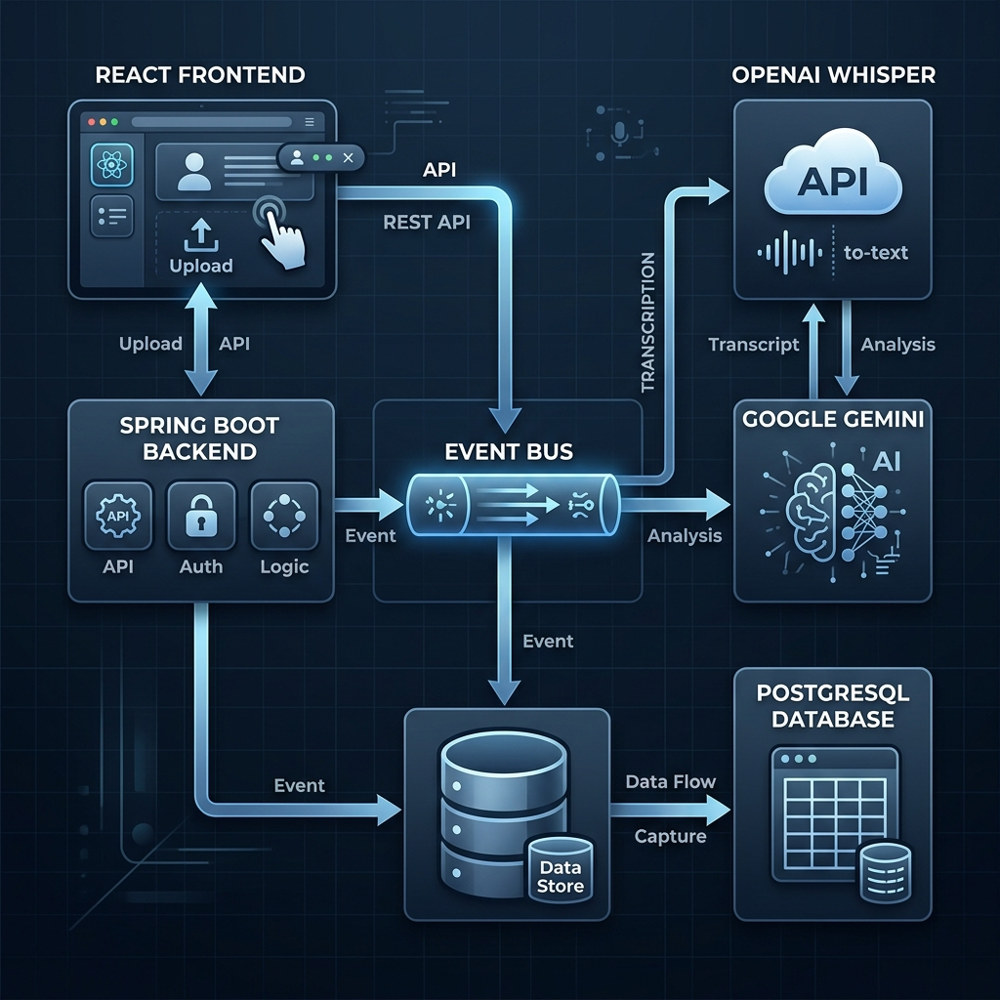
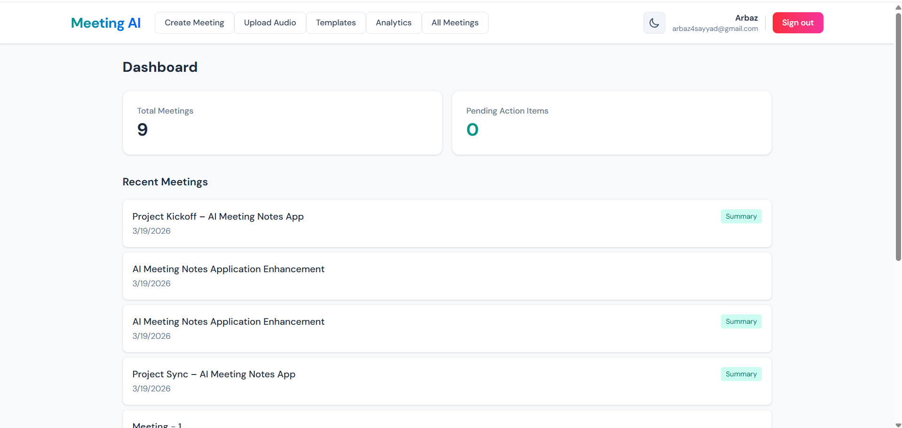
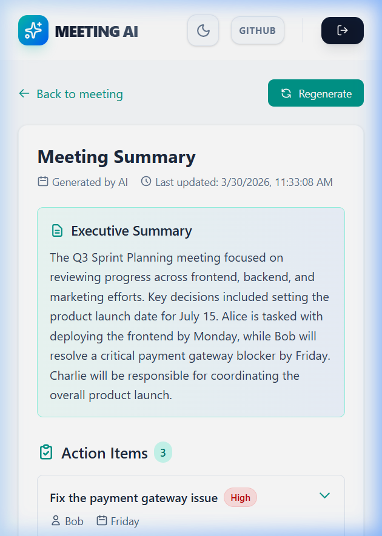
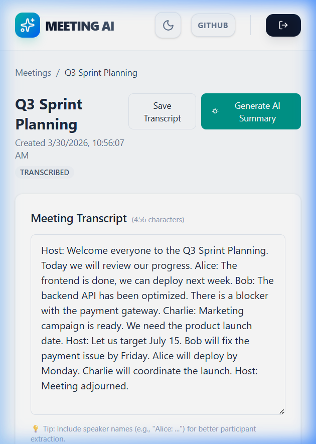
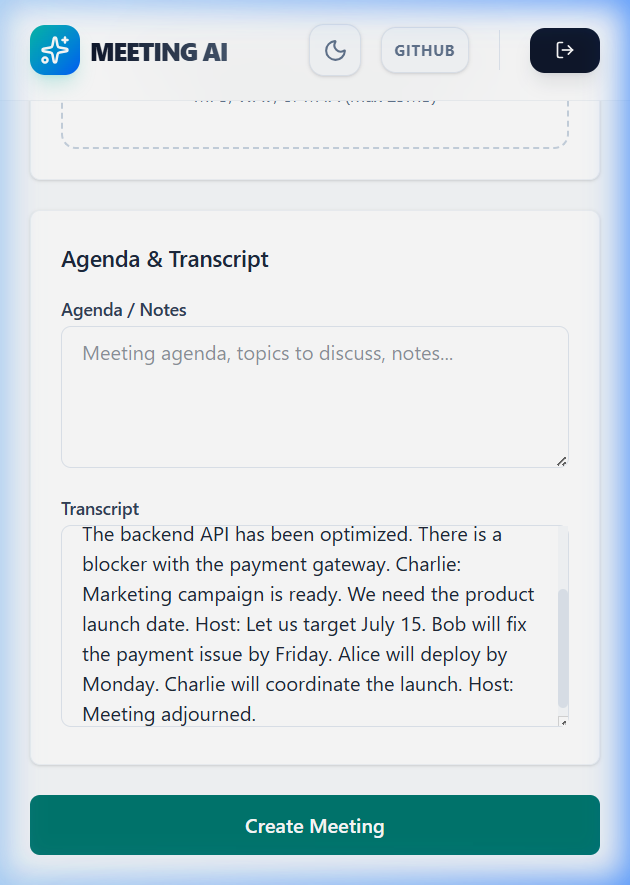
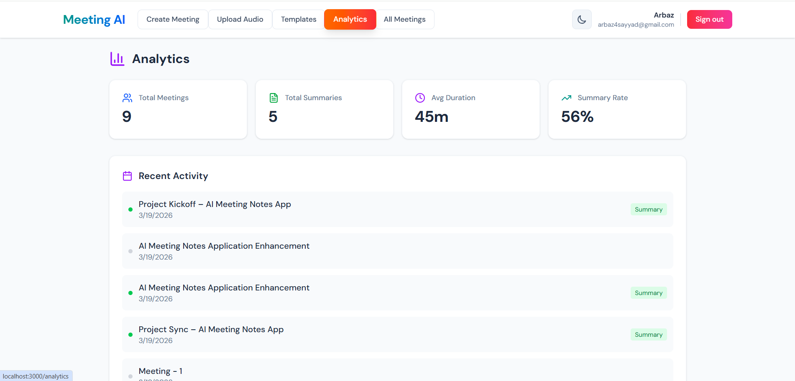
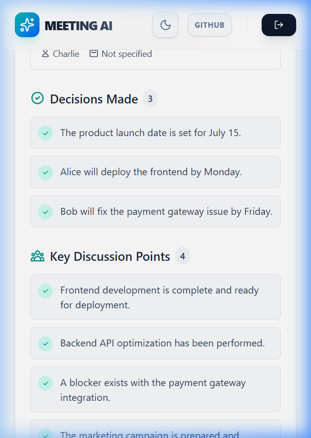
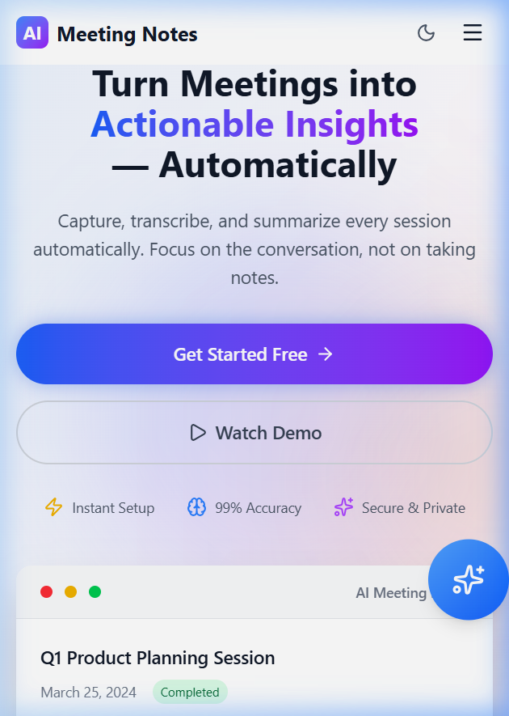

# 🤖 AI Meeting Notes - Intelligent Meeting Management System

[](https://opensource.org/licenses/MIT)
[](https://www.oracle.com/java/)
[](https://spring.io/projects/spring-boot)
[](https://reactjs.org/)
[](https://www.docker.com/)

> ⚡ Processes meeting audio into structured insights in under a minute using an asynchronous AI pipeline.

---

## 🚀 Overview

AI Meeting Notes is an asynchronous meeting intelligence platform that converts raw audio and transcripts into structured, actionable insights.

It automatically extracts **decisions, action items, and risks** using AI-powered transcription and summarization.

---

## 📊 Executive Summary

| Metric | Value |
|-------|------|
| Note-taking Effort | ~70% reduction |
| Processing Latency | < 45s for 15-min meetings |
| API Response Time | ~200–500ms |
| Processing Model | Asynchronous |

---

## 🎥 Live Demo


---

## 🎯 Problem Statement

Meetings generate large amounts of unstructured data, making it difficult to extract insights, track decisions, and ensure accountability.

---

## 💡 Solution

AI Meeting Notes transforms raw meeting data into structured outputs using an asynchronous AI pipeline, enabling better decision-making and execution tracking.

---

## 🧩 System Architecture

The system uses an **asynchronous processing pipeline** built on Spring’s event mechanism to handle high-latency AI tasks without blocking user requests.

### Processing Flow

1. Upload → Audio/transcript via REST API  
2. Event Trigger → Internal event published  
3. Transcription → Whisper / Google STT  
4. AI Processing → Gemini summarization  
5. Persistence → Stored in PostgreSQL  



---

## 🏗️ Tech Stack (Why These Choices)

| Layer | Technology | Reason |
|------|-----------|--------|
| Backend | Spring Boot (Java 17) | Scalable, async support |
| Frontend | React 18 + Vite | Fast UI, modular |
| Database | PostgreSQL | Strong consistency |
| Auth | JWT + OAuth2 | Stateless security |
| AI | Gemini + Whisper | Reliable NLP |
| Infra | Docker Compose | Consistent environments |

---

## 🎯 Core Capabilities

- Asynchronous AI processing (`@Async`)
- AI-based decision & action extraction
- Multi-provider transcription fallback
- Secure authentication (JWT + OAuth2)
- Responsive UI with validation

---

## ⚙️ Engineering Decisions & Trade-offs

### Stateless JWT
✔ Enables horizontal scaling  
❌ Requires client-side token handling  

### Asynchronous Processing
✔ Non-blocking API responses  
✔ Improved user experience  
❌ Increased architectural complexity  

### PostgreSQL (RDBMS)
✔ Strong consistency  
✔ ACID guarantees  
❌ Less flexible than NoSQL  

---

## 🛡️ Reliability & Failure Handling

- Fallback between Whisper & Google STT  
- Manual transcript fallback  
- Retry mechanism for API failures  
- Strict input validation  

---

## 📈 Performance & Scalability

- 🎧 Transcription latency: ~30–60s (25MB audio)  
- ⚡ AI summary generation: <15s  
- 🚀 API response time: ~200–500ms  
- 🔄 Non-blocking async processing pipeline  

---

## 🎨 Design Principles

- Clean Architecture  
- SOLID principles  
- DRY design  
- UX-first async feedback  

---

## 🚀 Quick Start

```bash
git clone https://github.com/Arbaz4Sayyad/AI-Meeting-Notes.git
cd AI-Meeting-Notes

cp .env.example .env
docker-compose up -d --build


```
*   **Frontend**: http://localhost:3000
*   **Backend**: http://localhost:8080
*   **API Docs**: http://localhost:8080/swagger-ui.html

---

## 📊 API Documentation

> 📖 **Interactive Documentation**: Access the full OpenAPI/Swagger specification at [/swagger-ui.html](http://localhost:8080/swagger-ui.html) when the backend is running.

---

## 📸 Screenshots

| Dashboard | Summary | Transcript | Create Meeting |
|----------|--------|------------|----------------|
|  |  |  |  |
| **Analytics** | **Summary Details** | **Landing Page** | **Auth Options** |
|  |  |  |  |

---

## 🗺️ Roadmap & Future Improvements

-   [ ] **Vector Database Integration** - Implement RAG for searching across years of meeting archives.
-   [ ] **Real-time Transcription** - Transition from batch to WebSocket-based live streaming.
-   [ ] **Multi-Model Fallback** - Automatic switching between Gemini, Claude, and GPT for resiliency.
-   [ ] **Mobile App** - Native iOS/Android app for recording on-the-go.

---

## 👨‍💻 Author

<div align="center">
  <h2>Arbaz Sayyad</h2>
  <p><strong>Full Stack Software Engineer</strong></p>
  <p>Specialising in Java Spring Boot, React, and Asynchronous AI System Design.</p>
  
  <p>
    <a href="https://www.linkedin.com/in/arbaz-sayyad/">🔗 LinkedIn</a> | 
    <a href="https://github.com/Arbaz4Sayyad">💻 GitHub</a>
  </p>
  
  <p>⭐ If this architecture helped your project, please give it a star!</p>
</div>
